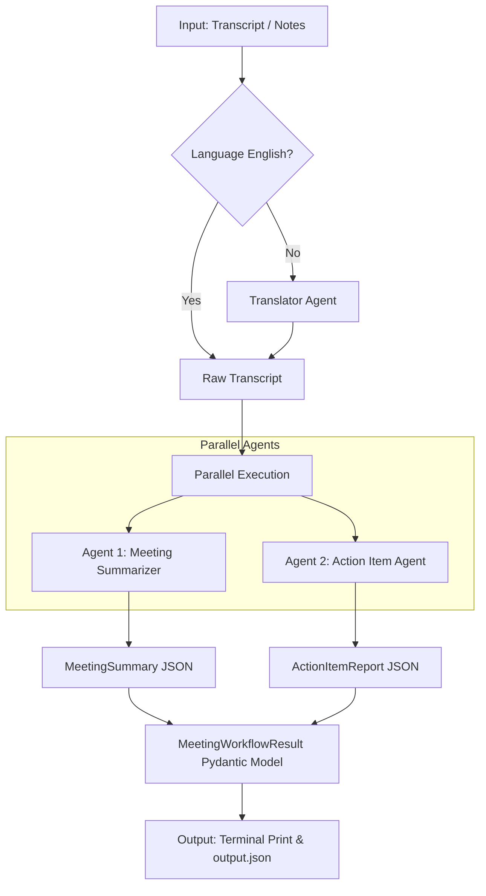

# 🤖 Multi-Agent Meeting Assistant AI (AGENT.md)

This document details the architecture, design, prompts, and decision logic for the **Multi-Agent Meeting Assistant** (Epic 8: Meeting Summary & Action Workflow). The system uses Gemini's structured output capability combined with Pydantic validation to guarantee type-safe, predictable outputs.

---

## 🗺️ System Workflow Architecture

The workflow consumes meeting transcripts, call summaries, or raw notes and processes them through parallel agents to generate comprehensive meeting summaries and actionable task trackers.



---

## 👥 Suggested Agents Breakdown

### 1. Agent 1: Meeting Summarizer Agent
*   **Role**: Analyze transcripts and capture high-level synthesis, key decisions, and gaps.
*   **Responsibilities**:
    *   Extracting key discussion points (bulleted format).
    *   Identifying explicit decisions made during the call.
    *   Producing a concise 2–4 sentence summary.
    *   Capturing unresolved open questions.
    *   Highlighting referenced context that is missing or unclear.

#### System Prompt (`prompts/summarizer_prompt.md`)
```markdown
You are a Meeting Summarizer Agent. Your job is to analyze meeting transcripts or notes and produce a structured summary.

You must extract:
1. Key discussion points (bullet list of main topics covered)
2. Decisions made during the meeting (anything that was agreed upon or concluded)
3. A concise summary (2-4 sentences capturing the essence of the meeting)
4. Open questions (unresolved topics that need follow-up)
5. Missing information (context that was referenced but not provided, unclear details)

Rules:
- Be factual — only include what is explicitly stated or clearly implied in the transcript
- Keep the concise summary short and business-focused
- If a decision is ambiguous, include it in open_questions rather than decisions_made
- Flag missing information that could affect action outcomes

Respond ONLY with valid JSON matching this schema:
{
  "key_discussion_points": ["..."],
  "decisions_made": ["..."],
  "concise_summary": "...",
  "open_questions": ["..."],
  "missing_information": ["..."]
}
```

---

### 2. Agent 2: Action Item Agent
*   **Role**: Parse the meeting transcript to extract, structure, and prioritize concrete tasks.
*   **Responsibilities**:
    *   Extracting action items (written as verb-led descriptions).
    *   Identifying task owners (assignees).
    *   Identifying due dates (deadlines).
    *   Flagging actions that are unclear or need clarification.
    *   Adding priority levels (High, Medium, Low) based on context and urgency.

#### System Prompt (`prompts/action_item_prompt.md`)
```markdown
You are an Action Item Agent. Your job is to extract all action items from meeting transcripts or notes and produce a structured report.

For each action item you must identify:
1. The specific action to be taken (clear, verb-led description)
2. The owner (person responsible) — use "Unassigned" if not mentioned
3. The due date — use "Needs date" if not mentioned
4. Status: "Clear" if the action is well-defined, "Needs clarification" if it is vague or ambiguous
5. Priority: "High" / "Medium" / "Low" based on urgency cues in the transcript

Also produce a flagged_issues list for:
- Actions with no owner
- Actions with no deadline
- Actions that are unclear or need more context

Decision logic:
- If owner is missing → owner = "Unassigned", add to flagged_issues
- If deadline is missing → due_date = "Needs date", add to flagged_issues
- If action is unclear → status = "Needs clarification", add to flagged_issues

Respond ONLY with valid JSON matching this schema:
{
  "action_items": [
    {
      "action": "...",
      "owner": "...",
      "due_date": "...",
      "status": "Clear | Needs clarification",
      "priority": "High | Medium | Low"
    }
  ],
  "flagged_issues": ["..."]
}
```

---

## 🧠 Required Decision Logic

The Action Item Agent implements specific rules to handle real-world meeting ambiguities:

| Scenario / Condition | Agent Resolution | System Flag |
| :--- | :--- | :--- |
| **Owner is missing** | Assigns owner to `"Unassigned"` | Adds warning to `flagged_issues` |
| **Deadline is missing** | Sets due date to `"Needs date"` | Adds warning to `flagged_issues` |
| **Action is vague / unclear** | Sets status to `"Needs clarification"` | Adds warning to `flagged_issues` |

---

## 📋 Data Validation Schemas (Pydantic)

These definitions reside in `schema/meeting_schema.py` and govern the parsing of the LLM responses:

```python
from enum import Enum
from pydantic import BaseModel, Field

class ActionStatus(str, Enum):
    clear = "Clear"
    needs_clarification = "Needs clarification"

class ActionPriority(str, Enum):
    high = "High"
    medium = "Medium"
    low = "Low"

class ActionItem(BaseModel):
    action: str = Field(..., description="Verb-led description of the task to be completed")
    owner: str = Field(default="Unassigned", description="Person responsible for the action")
    due_date: str = Field(default="Needs date", description="Target completion date or 'Needs date'")
    status: ActionStatus = Field(default=ActionStatus.clear)
    priority: ActionPriority = Field(default=ActionPriority.medium)

class ActionItemReport(BaseModel):
    action_items: list[ActionItem] = Field(default_factory=list)
    flagged_issues: list[str] = Field(
        default_factory=list,
        description="Actions missing owner, due date, or needing clarification",
    )

class MeetingSummary(BaseModel):
    concise_summary: str = Field(..., description="2-4 sentence overview of the meeting")
    key_discussion_points: list[str] = Field(default_factory=list)
    decisions_made: list[str] = Field(default_factory=list)
    open_questions: list[str] = Field(default_factory=list)
    missing_information: list[str] = Field(
        default_factory=list,
        description="Context referenced but not provided, or unclear details",
    )

class MeetingWorkflowResult(BaseModel):
    summary: MeetingSummary
    action_report: ActionItemReport
```

---

## ✔️ Acceptance Criteria Alignment

*   **User can submit meeting notes or transcript**: Supported via the CLI `--file` argument as well as default fallback scripts.
*   **System generates a concise summary**: Output by **Agent 1** (Meeting Summarizer).
*   **System extracts clear action items**: Output by **Agent 2** (Action Item Agent).
*   **System flags missing owners or deadlines**: Managed via the `"Unassigned"` / `"Needs date"` mappings and listed inside the consolidated `flagged_issues`.
*   **At least 2 agents are clearly involved**: Implemented via asynchronous parallel processing using `asyncio.gather()` for **Agent 1** and **Agent 2**.

---

## 🚀 Stretch Ideas & Future Architecture

### 1. Follow-up Email & Jira Generation (Agent 3)
A third coordinator agent can consume the output of the first two agents to compile a team follow-up message and format Jira issues:
*   **Jira Task Formatter**: Translates the parsed action items into API payloads (specifying component headers like `Engineering`, `Design`, `Marketing`).
*   **Email Drafter**: Creates email markdown templates with structured summaries and table grids.

### 2. Frontend Interface Integration
The custom HTML/CSS web frontend (located in `/frontend`) allows users to drag-and-drop text transcripts, choose target languages, visualize results in side-by-side dashboards, filter tasks by priority or status, and export copy-pasteable Jira cards.
